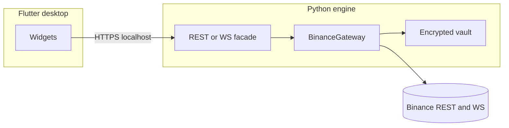

# Target architecture (Flutter desktop + Python engine)

Human coordination in Spanish (`README` policy); technical identifiers and code remain English.

## Current state

- Single Python package `runtime/` with NiceGUI embedded in-process.
- Binance connectors and vault live in-process with the HTTP UI.

## Target state (simple split)

```
PecunatorCore/
├── engine/              # Python: gateways, vault, connectors (later: renamed from runtime/ OR symlink)
├── desktop_shell/       # Flutter desktop UI (generated by Flutter SDK)
├── docs/
└── scripts/
```

1. **`engine` (Python)**  
   - Own process; exposes a **narrow API**: REST + optional WebSocket (or stdin/stdout JSON-RPC for prototyping).  
   - Reuses `BinanceGateway`, vault, and polling loops with minimal duplication.  
   - NiceGUI can remain temporarily behind a flag or retire once Flutter covers flows.

2. **`desktop_shell` (Dart / Flutter)**  
   - Flutter **desktop** (Windows/Linux/macOS) for chrome, animations, offline-capable UX.  
   - Talks only to `engine` HTTP/WebSocket — no Binance secrets in Dart.  
   - State: immutable ViewModels + reactive UI (Bloc/Riverpod is optional later).

3. **Boundaries**

   - Credentials: never shipped to Flutter; vault stays in Python `engine` data dir.  
   - UI shows connection status + read-only aggregates from API responses only.



## Migration phases

| Phase | Action |
|-------|--------|
| 0 | Freeze behavior; ship docs + bootstrap script (this repo). |
| 1 | Install Flutter SDK; run `scripts/init_flutter_desktop.ps1` to scaffold `desktop_shell/`. |
| 2 | Add thin FastAPI/Uvicorn (or aiohttp) in `engine/` that wraps existing gateways. |
| 3 | Port dashboards one screen at a time into Flutter; delete NiceGUI when parity achieved. |

## Why not rewrite everything immediately

Keeping `runtime/` until `engine/` + API exist avoids a prolonged broken state. Rename `runtime` → `engine` once imports/tests are adjusted in one focused migration.
